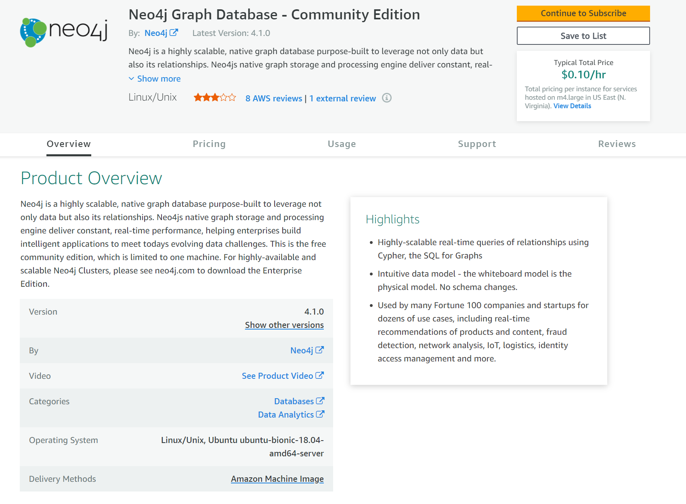
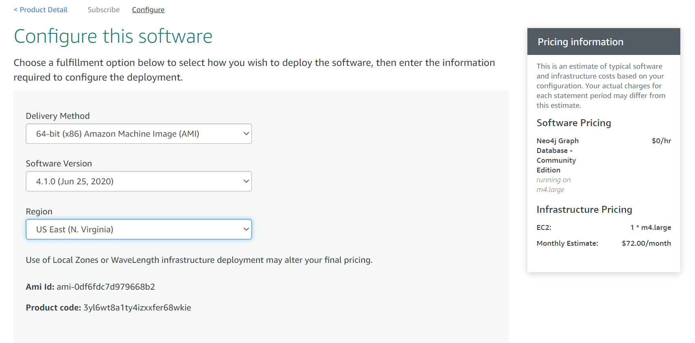
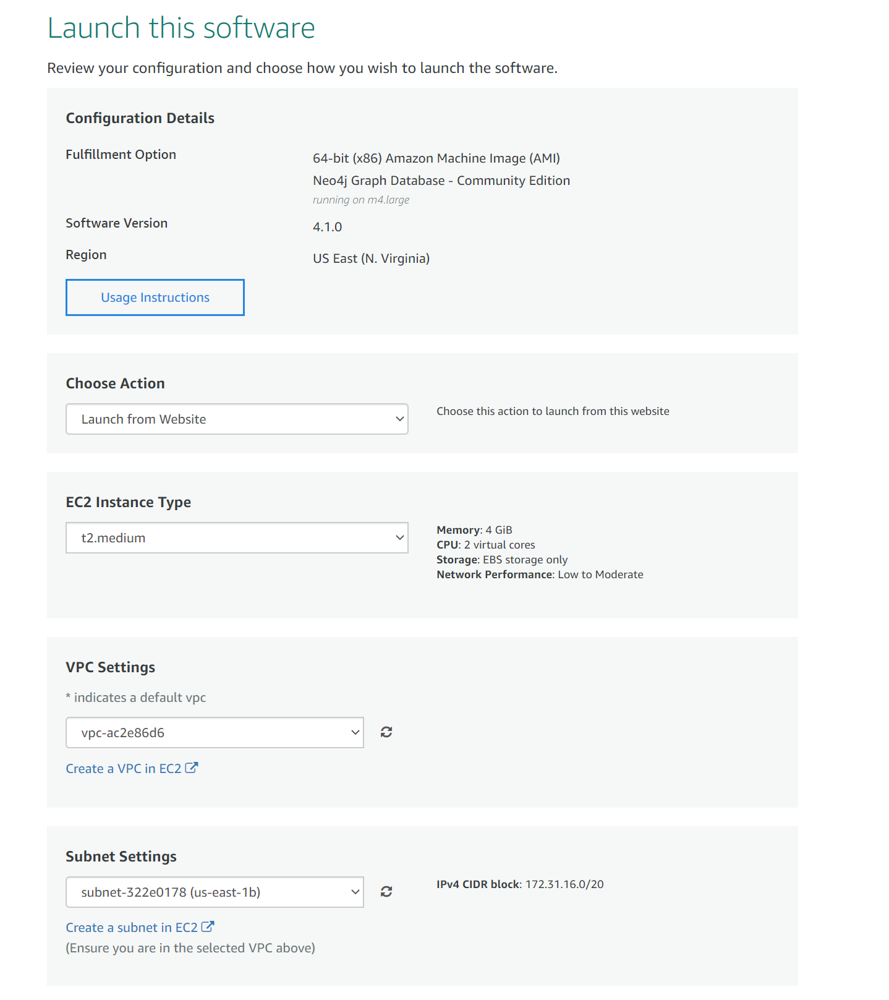
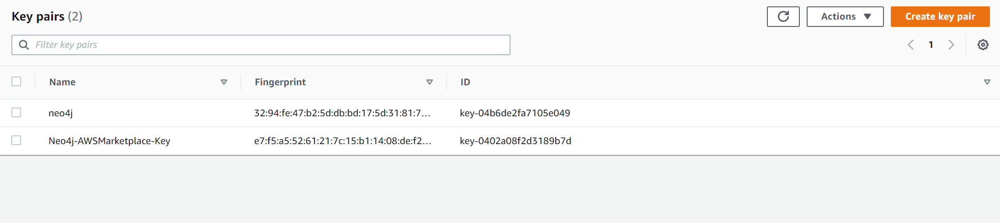
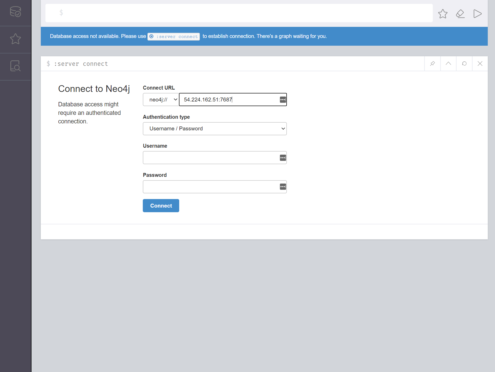
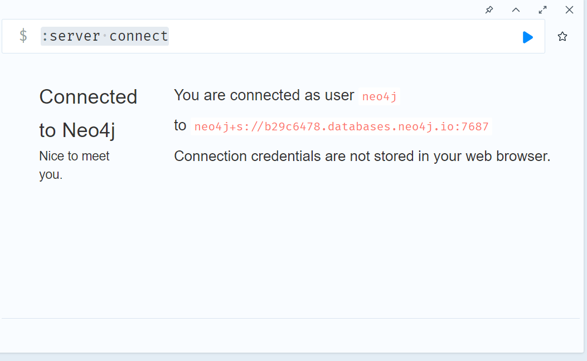

# Lab 5: Graph databases and Neo4j 


## Overview

Neo4J is a native NoSQL, graph database platform using Cypher querying language<sup>1</sup>. Graph databases are optimized for managing relationships and networks. In this lab we will deploy an Amazon EC2 sever with Neo4j installed utilizing the Amazon marketplace and Amazon Machine Images (AMI). AMIs allow consumers to create and deploy Amazon services with addtional software and customizations already installed and ready for use. After installations we will connect to your EC2 Neo4J instance in the cloud using the Neo4J browser connection. Follow the steps outlined below to connect to your Neo4J instance and begin loading and manipulating the data. 

To complete this assignment, please provide an export the images where applicable and submit to brandon.chiazza@yu.edu. 

<h3> Contents </h3>

<ol>
 <li>Launch an EC2 server with Neo4J Installed from the AWS Marketplace in the Console</li>
 <li>Use the Neo4J browser to connect to the Neo4j instance you created</li>
 <li>Run some simple queries in Cypher</li>
 <li>Load and Manipulate Data in Neo4j</li>
 <li>Resources</li> 
</ol>


## 1. Launch an EC2 server with Neo4J Installed from the AWS Marketplace in the Console
In this first step, we will create a Neo4J installation on an EC2 using Amazon's Machine Images (pre-configured servers that support your selected software insallation). You will confirm your connectivity via the Neo4J browser. If you do not currently have Neo4J installed, please [download Neo4J](https://neo4j.com/download-neo4j-now/?utm_program=na-prospecting&utm_source=google&utm_medium=cpc&utm_campaign=na-search-graph-databases&utm_adgroup=graph-databases-general&gclid=CjwKCAjwj6SEBhAOEiwAvFRuKI2SzVYSu7Ko_C2p-9TMRdPOsLVz-B7dU7WM9fPY5t6BsgTJrphMXBoCbW0QAvD_BwE). 


**1. AWS marketplace**
<ol>
<li>Log-in to your AWS console</li>
<li>From the AWS Console, navigate to the AWS marketplace https://aws.amazon.com/marketplace</li>
<li> Search for neo4j graph database (be sure to select community edition)</li>
</ol>


**2. Subscribe and configure**
We will now subscribe to Neo4J service which will walk us through the steps of deploying an EC2 instance with a Special AMI (amazon machine image) which will already contain neo4j running and ready as soon as the EC2 is deployed.
   
   1. **configure**
           in the configure you will select your image  software versions and AWS location please mimic the selections below 

    

   2. **create security group and select options**
        

   3. **create or select key**
create a new key or select one you have previous created and have access to  (you will need this to log into your EC2)
        
   4. **deploy**
        select deploy and your new neo4j EC2 will be ready to use in a min or two


### 2. Use the Neo4J browser to connect to the Neo4j instance you created

In this next section, we will log into the Neo4J console via the Neo4J Browser. Note: because of the way Neo4J authenticates using any browser besides chrome can be difficult unless you log into the server and create a signed ssl certificate. See the [reference article](https://medium.com/neo4j/getting-certificates-for-neo4j-with-letsencrypt-a8d05c415bbd) in you want to look into sll certificates.

2. http://{public dns}:7474/ 
   head to the EC2 console so you can get the dns of your new EC2 sever and then put it into chrome you should see the screen below 

   
   
3. log into server

   1. user: neo4j

   2. password: neo4j
   you will be prompted to make a new password
   



   

### 3. Run some simple queries in Cypher
   instead of SQL neo4j uses the cypher language:
   reference documentation https://neo4j.com/docs/cypher-manual/4.1/

   1. finding nodes and relationships

   to find nodes/relationships and patterns between them we us the match clause

```cypher
  // lets find all nodes in our database
  match (n)  // () stands or node and n is the variable we bind the patern too
  return n // if we wanted only 1 field (think collumn) we could specify that with dot notation //n.{feild name}
```

   2. creating nodes and edges 
       When using the cypher query langue we bind parts of our query to variables which can be reused in the same query. In the example below we bind the J to the Person node with name Jacob and then use that variable to create a relationship and return the node when the query is executed.

```cypher
 //creating nodes
 
 create (j:Person{name:"Jacob",age:34,role:"graduate student"})
   
 create (IA:class{name:"information architecture",program:"Data analytics & visualisation"})
 
 //creating relationships
 create (j)-[t:TAs]->(IA)
 return j,t,IA 
```


  Relationships are a powerful concept the allow us to look for recursive relationships with ease and join data that would be difficult to do in a Relational database 

   3. creating relationships on existing nodes
```cypher
match (IA:class) // first we match and assign our match to a varible IA
   where IA.name ="information architecture"
//then we create new features
create (b:Person {name:"brandon",role:"teacher"})
 //creating the relationship using the variable from our match 
create (b)-[t:Teaches]->(IA)
   return b,IA,t
```


​      

### 3. Load and Manipulate Data in Neo4j

1. from URL

```cypher

//first sanity checking our document and our connection

// count of records
lOAD CSV FROM "https://raw.githubusercontent.com/fivethirtyeight/russian-troll-tweets/master/IRAhandle_tweets_10.csv" AS line
RETURN count(*);

// check first 5 line-sample with header-mapping
LOAD CSV WITH HEADERS FROM "https://raw.githubusercontent.com/fivethirtyeight/russian-troll-tweets/master/IRAhandle_tweets_10.csv" AS line
RETURN line
LIMIT 5;


//now load data
//first we create constraints to prevent the creation of duplicate nodes  

CREATE CONSTRAINT Tweet_id
ON (n:Tweet)
ASSERT n.id IS UNIQUE;

CREATE CONSTRAINT user_id
ON (n:User)
ASSERT n.id is unique;


//create users

LOAD CSV WITH HEADERS FROM "https://raw.githubusercontent.com/fivethirtyeight/russian-troll-tweets/master/IRAhandle_tweets_10.csv" AS line
merge (u:User {id :line.external_author_id})
set u.name = line.author

;
//create tweets 

LOAD CSV WITH HEADERS FROM "https://raw.githubusercontent.com/fivethirtyeight/russian-troll-tweets/master/IRAhandle_tweets_10.csv" AS line
merge (t:Tweet {id :line.tweet_id})
set t.text = line.content ;

//create relationship 


LOAD CSV WITH HEADERS FROM "https://raw.githubusercontent.com/fivethirtyeight/russian-troll-tweets/master/IRAhandle_tweets_10.csv" AS line
match (u:User {id:line.external_author_id})
match (t:Tweet {id:line.tweet_id})
merge (u)-[r:tweeted]->(t)
set r.type = line.post_type
```

  2. query the result
     
              1. get the number of tweets for 1 user

       ```cypher
     match (n:User{id:"2912754262"})-[r]-(t) return n.name,count(distinct r)            
     ```
     
     2. get the first 100 tweets from  a user 
     
        ```cypher
        match (n:User{id:"2912754262"})-[r]-(t) return n,r,t limit 100
        ```
        
     3. on your own query the number of users and the average number of tweets
     
        
     
  3. Loading data from file:
        You can also use the same procedure above on a file instead of a URL. To do this we  need to transfer the file to the NEO4j inbox on our ec2

          1. send data file to server
                Their are multiple ways of transferring files to your EC2 instance. two are well described in this article:
                https://asf.alaska.edu/how-to/data-recipes/moving-files-into-and-out-of-an-aws-ec2-instance-windows/

          2. download data 
                For this next portion we will utilize selection of additional  twitter data from Kaggle

                https://www.kaggle.com/darkknight98/twitter-data?select=tweet_data.csv 
                it is in the data  folder of this repo [data](data/tweet-data.csv)
        
                  1. using putty secure copy
        
                       1. make sure you have the key you associated with the EC2 at launch .pkk
        
                       2. Copy file to home directory of ec2
                          because of permissions we won't move the file into our home directory and the login and move the file where it needs to be for neo4j to access it
        
                              1. in the command line
                                 `pscp -i {PATH TO KEY} {PATH TO .CSV}  ubuntu@{EC2 PUBLIC DNS}:tweets.csv`
        
                       3. SSH into ec2 using putty 
        
                              1. move file to proper location 
                                 `mv tweet_data.csv /var/lib/neo4j/import`
        
                       4. return to neo4j console 
                          check that you can now access the file
        
                          ```cypher
                          // count of records
                          lOAD CSV FROM "file:///tweets.csv" AS line
                          RETURN count(*);
                          
                          // check first 5 line-sample with header-mapping
                          LOAD CSV WITH HEADERS FROM "file:///tweets.csv" AS line
                          RETURN line
                          LIMIT 5;
                          
                          
                          ```
                     
                        5. use the load file procedure from above to load the additional users and tweets into our neo4j database


## Resources: 

1. What is Cypher? Cypher is Neo4j’s graph query language that allows users to store and retrieve data from the graph database. Neo4j wanted to make querying graph data easy to learn, understand, and use for everyone, but also incorporate the power and functionality of other standard data access languages. (Source: Cypher Query Langauge[Cypher Query Langauge](https://neo4j.com/developer/cypher/#:~:text=Cypher%20is%20Neo4j's%20graph%20query,other%20standard%20data%20access%20languages.)
